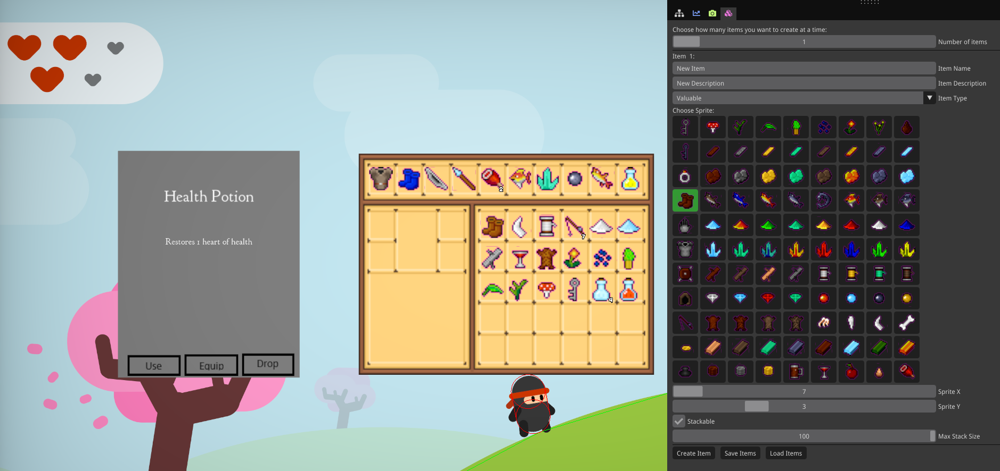
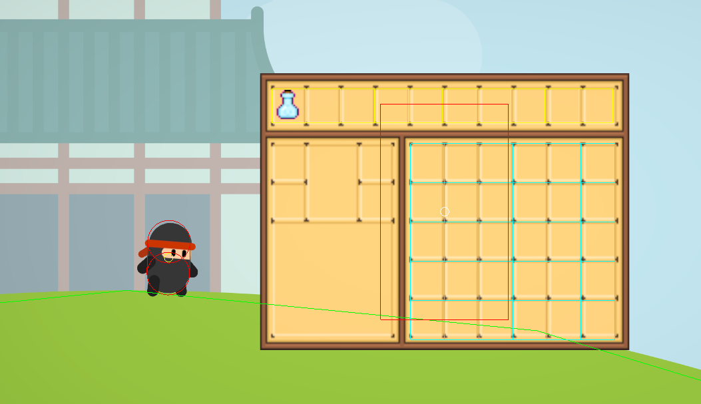
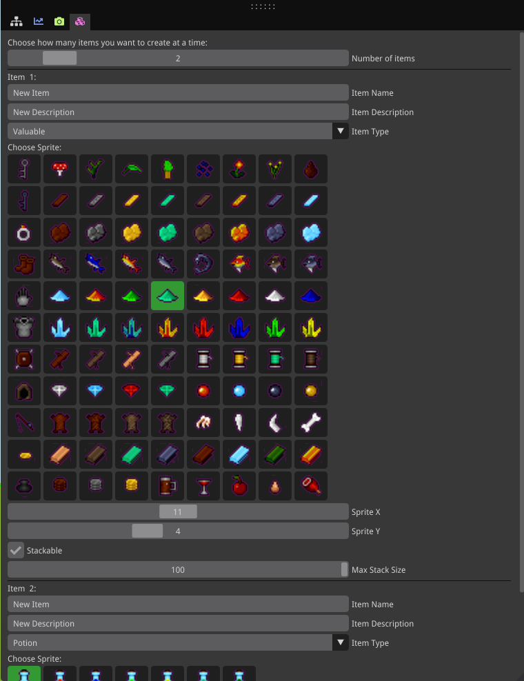
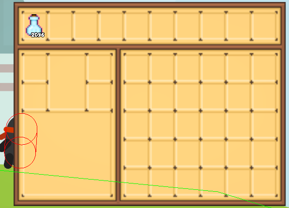

## Introduction

Ever wondered how inventory systems actually work under the hood? Not the Unity tutorial version where you drag components around, but the *real* nitty-gritty implementation? That's what I set out to build.

**Prerequisites:** Basic C++ knowledge will help you follow along. Fair warning though - I built this in Visual Studio using a custom template from my university (hence some of the quirky code structure you might spot), SDL2 for rendering, ImGui for item creation and a whole lot of trial and error.

### Why Build This?

An inventory system is often the backbone of survival games, RPGs, and adventure games. Think Minecraft's grid system, 7 Days to Die's crafting integration, or Dying Light's equipment management. I couldn't pick just one to emulate, so I basically mashed together my favorite features from all of them. 

Here's the thing - most inventory tutorials online assume you're using Unity or Unreal, where half the work is already done for you with built-in UI systems and drag-and-drop components. But what if you want to understand what's *actually* happening? What if you're working with a custom engine? That's where this project came in.

### What I Built

Here's what this system can do:
- **Custom item creation tool** - Level designers can create items without touching code
- **Drag and drop** - Because clicking to move items is so 2005
- **Right-click stack splitting** - For when you need exactly 32 wood planks, not 64
- **Multi-digit quantity displays** - Your 9,999 gold coins deserve proper representation
- **Item popup system** - Use, equip, or drop items with a clean context menu
- **Full serialization** - Save and load item data and positions in the scene

### Starting Point: Design First, Code Later

Before I wrote a single line of inventory code, I needed to figure out what this thing should actually *look like* and *behave like*. When I started, I had a blank canvas and way too many ideas. So I broke it down into the core questions every inventory system needs to answer:

**The Big Questions:**
1. How many slots should the inventory have?
2. Should items stack? If yes, what's the max stack size?
3. What information does each item need to store?
4. How should the UI look and feel?
5. What can players actually *do* with items?

For my system, I landed on:
- **Grid-based layout** - A 10x4 grid (40 slots total) felt right for a survival-style game
- **Stackable items** - Because who wants to carry 50 individual arrows in separate slots?
- **Item properties** - Name, description, type (potions/armour/weapons/valuable), sprite, and stack limit
- **Visual feedback** - Highlight slots on hover, show quantities clearly, smooth drag animations

## The ECS Approach

My engine uses an Entity Component System (ECS) architecture, which means items aren't just structs sitting in an array - they're actual entities in the world. This might seem overkill for an inventory, but it came with some nice benefits:

**Items as Entities:**
- Each item in the inventory is an entity with components (Transform, Sprite, ItemData)
- When you drop an item, it already exists in the world - no conversion needed
- Picking up items? Just move the entity from the world to the inventory
- Consistent behavior whether items are held or dropped

**The tricky part?** Managing entity lifecycles. Items needed to exist in different "states":
- In the world (normal entity with physics)
- In the inventory (visual only, no physics)
- Being dragged (following mouse, semi-transparent)

I handled this with a simple state machine and component enable/disable logic.

### Data Structure

Here's the basic structure for the inventory itself:
```cpp
class Inventory {
private:
    std::vector<Slot> m_slots;
    bool m_isVisible = false;
    int m_capacity;
    
public:
    bool AddItem(Entity* item);
    bool RemoveItem(int slotIndex);
    void ToggleUI();
    void Update(float deltaTime);
    void MoveItem(int sourceSlot, int destSlot);
};
```

Each inventory slot is super simple:
```cpp
class Slot {
private:
    Item* m_item;
    int m_quantity;
public:
    bool IsEmpty() const { return m_item == nullptr; }
    bool AddQuantity(int amount);
    bool RemoveQuantity(int amount);
    void Clear();
};
```
Last but not least, the item class:
```cpp
class Item {
private:
	std::string m_name;
	std::string m_description; 
	std::string m_texturePath;
	ItemType m_type;
	bool m_stackable;
	int m_maxStackSize;
	int m_spriteX;
	int m_spriteY;
}
```
Clean and straightforward. No over-engineering here.

## Building the Inventory UI

Now for the visual part - actually displaying the inventory on screen.

### Creating the Inventory Entity

I followed the template's approach of using quads with mesh renderers and materials. Here's how I set up the main inventory UI:
```cpp
 m_meshRenderers["Inventory"] =
     MeshRenderer(CreateQuad(vec2(0.f), vec2(6.5f, 4.875f)), CreateMaterial(FileIO::Directory::Assets, "textures/inventory.png"));`
```

The key decision here: **parenting to the UI canvas**. This ensures the inventory moves with the camera and scales properly across different screen sizes.

### Show/Hide with Alpha Blending

I initially tried scaling the inventory to 0 for hiding it, but this broke the child icon transforms. The solution? **Alpha blending**:

**Important detail**: I also stop player movement when the inventory is open by setting linear velocity to 0 in the player control code.

```cpp
// Smooth fade in/out
    float targetAlpha = m_playerInventory->IsVisible() ? 1.f : 0.f;
    float currentAlpha = renderer.Material->BaseColorFactor.a;
    float newAlpha = Damp(currentAlpha, targetAlpha, 15.f, dt);

    renderer.Material->BaseColorFactor.a = newAlpha;
```

## Positioning the Inventory Slots

This was trickier than expected. I needed to place slot icons that perfectly align with the inventory texture's visual slots.

### The Layout Math

My inventory texture is 200x150 pixels, displaying as a 6.5 x 4.875 world-space quad. It has:
- **10 slots in the top row** (hotbar)
- **6 columns × 5 rows** on the right side (storage grid)

Here's how I calculated slot positions:
```cpp
const int capacity = m_playerInventory->GetCapacity(); // 40 slots total
m_inventorySlotIcons.resize(capacity);

float invWidth = 6.5f;
float invHeight = invWidth * (150.0f / 200.0f); // Maintain aspect ratio = 4.875f

float slotSize = invWidth / 10.f; // Each slot is 1/10th of inventory width = 0.65

// Calculate where the first slot starts (top-left of hotbar)
float firstSlotCenterX = -invWidth / 2.0f + slotSize / 2.0f;
float topRowCenterY = invHeight / 2.0f - slotSize / 2.0f;
```

### Top Row (Hotbar Slots 0-9)

The top row is straightforward - 10 evenly spaced slots:
```cpp
const int numVisibleSlots = 10;

for (int i = 0; i < numVisibleSlots; i++)
{
    auto slotIcon = ecs.CreateEntity();

    auto& iconTransform = ecs.CreateComponent(slotIcon);
    iconTransform.Name = "Slot Icon" + std::to_string(i);
    iconTransform.SetParent(m_inventory); // Parent to inventory for relative positioning

    float iconScale = slotSize * 0.8f; // Make icons slightly smaller than slots

    // Fine-tuning offsets to align with texture
    float offsetX = slotSize * 0.25f;
    float offsetY = -slotSize * 0.35f;

    // Calculate position: start position + (slot width * index) + offset
    float x = firstSlotCenterX + ((slotSize - 0.04f) * i) + offsetX;
    float y = topRowCenterY + offsetY;

    iconTransform.SetTranslation(vec3(x, y, 26.f)); // Z=26 renders above inventory (Z=25)
    iconTransform.SetScale(vec3(iconScale));

    m_inventorySlotIcons[i] = slotIcon;
    
    // Start with empty/invisible icon
    auto emptyMesh = CreateSpriteSheetQuad(0, 0, 1, 1, vec2(1.f, 1.f));
    auto emptyMaterial = std::make_shared();
    emptyMaterial->BaseColorFactor = vec4(0.f, 0.f, 0.f, 0.f); // Fully transparent
    emptyMaterial->IsUnlit = true;
    
    ecs.CreateComponent(slotIcon, emptyMesh, emptyMaterial);
}
```
**Key details:**
- `(slotSize - 0.04f)` - Small gap between slots for visual separation
- `offsetX` and `offsetY` - Fine-tuning to match the texture's slot positions exactly
- Icons scale to 80% of slot size to fit nicely within the visual boundaries

### Right Grid (Storage Slots 10-39)

The right side grid required different calculations:
```cpp
const int rightGridStartIdx = 10; // Start after hotbar
const int rightGridRows = 5;
const int rightGridCols = 6;

// Grid needs taller slots to match the texture design
float rightSlotSizeY = slotSize * 1.15f;

// Position grid starting at column 4 of the top row
float rightGridStartX = firstSlotCenterX + ((slotSize - 0.05f) * 4) + 0.05f;
float rightGridStartY = topRowCenterY - (slotSize * 2) + 0.25f; // Two rows down

for (int i = rightGridStartIdx; i < rightGridStartIdx + (rightGridRows * rightGridCols) && i < capacity; i++)
{
    int gridIdx = i - rightGridStartIdx;
    int row = gridIdx / rightGridCols; // Which row (0-4)
    int col = gridIdx % rightGridCols; // Which column (0-5)

    auto slotIcon = ecs.CreateEntity();
    auto& iconTransform = ecs.CreateComponent(slotIcon);
    iconTransform.Name = "Slot Icon" + std::to_string(i);
    iconTransform.SetParent(m_inventory);

    float iconScale = slotSize * 0.8f;
    float offsetX = slotSize * 0.25f;
    float offsetY = -slotSize * 0.35f;

    // Calculate grid position
    float x = rightGridStartX + ((slotSize - 0.05f) * col) + offsetX;
    float y = rightGridStartY - ((rightSlotSizeY - 0.05f) * row) + offsetY;

    iconTransform.SetTranslation(vec3(x, y, 26.f));
    iconTransform.SetScale(vec3(iconScale));

    // Same empty setup as hotbar
    auto emptyMesh = CreateSpriteSheetQuad(0, 0, 1, 1, vec2(1.f, 1.f));
    auto emptyMaterial = std::make_shared();
    emptyMaterial->BaseColorFactor = vec4(0.f, 0.f, 0.f, 0.f);
    emptyMaterial->IsUnlit = true;
    ecs.CreateComponent(slotIcon, emptyMesh, emptyMaterial);
    
    m_inventorySlotIcons[i] = slotIcon;
}
```

**Why this is complex:**
- The grid doesn't start at the left edge - it's offset to column 4
- Rows are taller (`rightSlotSizeY = slotSize * 1.15f`) to match the texture
- Negative Y for rows because Y increases upward in my coordinate system
- Each offset value (`0.05f`, `0.25f`, etc.) was discovered through trial and error to perfectly align with my specific inventory texture

### The Result

This positioning system creates 40 invisible "slots" that perfectly overlay the inventory texture. When items are added, their sprites appear exactly where the visual slots are drawn in the texture.

**Pro tip:** Use debug rendering to visualize the slot boundaries while tweaking these values. I originally had debug lines drawing rectangles around each slot, which made alignment much easier.



## Creating Items in the World

Before items can go into the inventory, they need to exist in the game world as entities that the player can pick up. 

### The Item Database

I maintain a global item database that stores the definitions of all items in the game. This database acts as a template - when I spawn an item in the world, I reference this database to get its properties.
```cpp
m_itemDatabase["Potion1"] = new Item(
    "Health Potion",
    "Restores 1 heart of health",
    "textures/itemset.png",
    ItemType::Potion,
    0, 0,  // sprite coordinates in sheet
    true,  // stackable
    99     // max stack size
);
```
### Creating Mesh Renderers for Items
For each item type, I create a reusable mesh renderer using the sprite sheet:
```cpp
auto spriteSheetMaterial = CreateMaterial(FileIO::Directory::Assets, "textures/itemset.png");
spriteSheetMaterial->IsUnlit = true;

m_meshRenderers["Potion1"] = MeshRenderer(
    CreateSpriteSheetQuad(0, 0, 16, 11, vec2(0.8f, 0.8f)), 
    spriteSheetMaterial
);
```
The `CreateSpriteSheetQuad` function calculates UV coordinates for a specific sprite in the sheet.

### Spawning Items in the World

I use a helper function which does all the heavy lifting, it creates the meshRenderer and the physics collider so that the items can be picked up.

```cpp
auto& meshRenderer = m_meshRenderers[meshRendererName];
ecs.CreateComponent(entity, meshRenderer.Mesh, meshRenderer.Material);
auto& collider = ecs.CreateComponent(entity, radius);
ecs.CreateComponent(entity, physics::Body::Type::Kinematic, collider, 1.0f, 1.0f).SetPosition(vec2(position));
```

### The ItemPickup - custom component that marks this as a pickable item
This simple component just stores which item this entity represents:
```cpp
struct ItemPickup {
    std::string m_itemName;  // Key into m_itemDatabase
    
    ItemPickup(const std::string& itemName) : m_itemName(itemName) {}
};
```
When the player collides with an entity that has `ItemPickup`, I know to add it to the inventory.

### Adding Items - The Stacking Logic

This is where it gets interesting. When adding an item, the inventory needs to:
1. Check if the item already exists in a slot (for stacking)
2. Find the first available empty slot if it doesn't exist
3. Handle partial stacks when a slot is nearly full
```cpp
if (item->IsStackable())
{
	// First pass: try to stack with existing items
	for (int i = 0; i < m_slots.size(); i++)
	{
		if (m_slots[i].IsEmpty())
			continue; // Skip empty slots in this pass

		Item* existingItem = m_slots[i].GetItem();

		// If it's literally the same Item pointer, skip the IsSameItem check
		if (existingItem == item || existingItem->IsSameItem(*item))
		{
			int currentQty = m_slots[i].GetQuantity();
			int maxStack = existingItem->GetMaxStackSize();
			int spaceAvailable = maxStack - currentQty;

			if (spaceAvailable > 0)
			{
				int amountToAdd = std::min(spaceAvailable, quantity);
				m_slots[i].AddQuantity(amountToAdd);
				quantity -= amountToAdd;

				// If we've added everything, we're done!
				if (quantity == 0)
					return true;

				// Otherwise, continue to next slot with remaining quantity
			}
		}
	}
	// If we still have items left, we need a new slot
	if (quantity > 0)
	{
		int emptySlot = FindEmptySlot();
		if (emptySlot == -1)
			return false; // Inventory full

		m_slots[emptySlot].SetItem(item);
		m_slots[emptySlot].SetQuantity(quantity);
		return true;
	}

	return true;
}
else
{
	// Non-stackable item
	int emptySlot = FindEmptySlot();
	if (emptySlot == -1)
		return false;

	m_slots[emptySlot].SetItem(item);
	m_slots[emptySlot].SetQuantity(quantity);
	return true;
}
```
**The algorithm breaks down to:**
1. **Stacking pass** - Fill existing partial stacks first (most space-efficient)
2. **Empty slot pass** - Create new stacks in empty slots for remaining items
3. **Overflow handling** - Return false if inventory is full

<video width="320" height="240" controls>
  <source src="additems.mp4" type="video/mp4">
</video>

## Item Creation Tool

To enhance new items being added to the scene, i created an interface to help level designers, or you, to visualize better the items spawned. For this i used imgui and i added all the variables that can be changed for the items. For choosing the item sprite, i also made the picking visible using boxes where i display the icons based on certain parts of the spritesheet for each type that i preconfigured.

To make adding new items easier for level designers (and myself), I built a visual editor tool using ImGui. This lets you create items without touching code and runs directly in the game window alongside the scene. It gives you input fields for all the item properties: name, description, type, and stacking behavior.

### Visual Sprite Selection

Here's where it gets interesting. Instead of typing sprite coordinates like `(5, 3)`, I display the actual sprite sheet with clickable boxes.
I pre-configured different sections of my sprite sheet for different item categories:
```cpp
void ItemCreation::GetSpriteRangeForType(ItemType type, int& minX, int& maxX, int& minY, int& maxY)
{
	switch (type)
	{
	case ItemType::Potion:
		minX = 0; maxX = 6;
		minY = 0; maxY = 0;
		break;
	case ItemType::Armour:
		minX = 4; maxX = 7;
		minY = 3; maxY = 5;
		break;
	case ItemType::Valuable:
		minX = 7; maxX = 15;
		minY = 0; maxY = 10;
		break;
	case ItemType::Weapon:
		minX = 0; maxX = 3;
		minY = 4; maxY = 8;
		break;
	default:
		break;
	}
}
```

The Create Item button does exactly what you'd expect - it takes all your inputs and generates the item.
```cpp
if (ImGui::Button("Create Item"))
{
	CreateItems(maxItems, itemNames, itemDescriptions, selectedType, spriteX, spriteY, stackable, maxStack);
}
```


## Displaying Item Quantities with Individual Digit Sprites

One of the visual details I'm proud of is how item quantities are displayed. Instead of rendering text dynamically (which can be expensive), I use individual digit sprites (0-9) that I combine to show any number.

### The Approach

The system displays any quantity by converting the number to a string, then processing each character individually. For example, the number 42 becomes the string "42", which contains two characters: '4' and '2'. The code loops through each character, converts it back to its numeric value (using the technique digitChar - '0', which turns '4' into 4 and '2' into 2), and loads the corresponding digit image file (digit-4.png and digit-2.png). Each digit is created as a separate visual entity and positioned side-by-side with small spacing between them in the bottom-right corner of the inventory slot. This way, any number—whether it's 9, 42, or 999—can be displayed by combining individual digit sprites (0-9) positioned next to each other.



```cpp
// Convert the quantity to a string of digits
std::string qtyStr = std::to_string(qty);  // e.g., qty=42 becomes "42"
int numDigits = static_cast<int>(qtyStr.length());  // = 2 digits

// Calculate spacing between digits
float digitSpacing = digitScale * 0.3f;

// Calculate total width needed for all digits
float totalWidth = (numDigits - 1) * digitSpacing;

// Position for the first digit (right-aligned)
float startX = slotPos.x + (iconScale * 0.4f) - totalWidth;
float startY = slotPos.y - (iconScale * 0.5f) + (digitScale * 0.5f) - 0.1f;

// Loop through each digit character in the string
for (int d = 0; d < numDigits; d++)
{
    char digitChar = qtyStr[d];  // Get character '4', then '2'
    int digitValue = digitChar - '0';  // Convert character to integer: '4' -> 4, '2' -> 2
    
    // Create separate entity for this digit
    auto digitEntity = ecs.CreateEntity();
    auto& digitTransform = ecs.CreateComponent<Transform>(digitEntity);
    
    // Position this digit (each digit is spaced apart)
    float digitX = startX + (d * digitSpacing);
    digitTransform.SetTranslation(vec3(digitX, startY, 27.f));
    
    // Load the correct digit texture (digit-0.png, digit-1.png, etc.)
    std::string digitTexture = "textures/digit-" + std::to_string(digitValue) + ".png";
    
    auto digitMaterial = CreateMaterial(FileIO::Directory::Assets, digitTexture);
    
    // Render this individual digit
    ecs.CreateComponent<MeshRenderer>(digitEntity, m_cachedDigitMesh, digitMaterial);
}
```

## Implementing Hover Detection and Item Popups

Once items are displayed in inventory slots, players need a way to see what each item is. This is where hover detection and item popups come in.

### The Hover Detection

 To implement hover detection, I had to convert the mouse position through multiple coordinate spaces to properly check collision with inventory slots. The mouse starts in screen space (pixel coordinates), which I convert to world space using the camera's position and the visible world dimensions calculated from the camera's bounding box width and aspect ratio. The inventory slots exist in UI canvas space, so I also calculate their world positions by adding the canvas transform's global position to each slot's local position relative to the inventory. Once both the mouse and slot positions are in the same world space coordinate system, I can perform AABB collision detection by checking if the mouse's world coordinates fall within each slot's minimum and maximum X and Y bounds. When a slot is being hovered, I increase its icon scale by 10% to provide visual feedback. This multi-step coordinate transformation ensures accurate hover detection regardless of camera movement or UI scaling. 
 ```cpp
 // Convert mouse from screen space to world space
float mouseWorldX = cameraTransform.GetTranslation().x + (mouseScreenPos.x / screenWidth - 0.5f) * worldWidth;
float mouseWorldY = cameraTransform.GetTranslation().y - (mouseScreenPos.y / screenHeight - 0.5f) * worldHeight;

// Calculate slot position in world space
float invLeft = invWorldPos.x - invWidth / 2.0f;
float invTop = invWorldPos.y + invHeight / 2.0f;
float slotCenterX = firstSlotCenterX + (slotSize * i);
float slotCenterY = firstSlotCenterY;

// AABB collision check
float minX = slotCenterX - slotSize / 2.0f;
float maxX = slotCenterX + slotSize / 2.0f;
float minY = slotCenterY - slotSize / 2.0f;
float maxY = slotCenterY + slotSize / 2.0f;

if (mouseWorldX >= minX && mouseWorldX <= maxX &&
    mouseWorldY >= minY && mouseWorldY <= maxY)
{
    currentHoveredSlot = i;
}
 ```
 ```cpp
 / Apply hover scale in UpdateInventorySlotIcons
float finalScale = iconScale;
if (i == m_hoveredSlotIndex)
{
    finalScale *= 1.1f; // 10% larger when hovered
}
iconTransform.SetScale(vec3(finalScale));
```
Additionally, a popup quad displaying the item's name and description appears when hovering over an item. The text rendering for the popup is implemented using SDL_ttf, which generates texture images from text that are then displayed on the popup. The three action buttons (Use, Equip, Drop) are part of the popup sprite itself rather than separate UI elements. To detect button clicks, I created collision boxes positioned to match the visual buttons in the sprite image, checking if the mouse position intersects with these invisible AABB regions to determine which button was clicked. This popup can be locked in place by clicking on the item, keeping it visible even when moving the mouse away, and unlocks when clicking outside the inventory, causing it to disappear.
```cpp
m_popup = ecs.CreateEntity();
auto& transform = ecs.CreateComponent<Transform>(m_popup);
transform.Name = "Popup";
transform.SetParent(m_uiCanvas);

auto& meshRenderer = m_meshRenderers["Popup"];
ecs.CreateComponent<MeshRenderer>(m_popup, meshRenderer.Mesh, meshRenderer.Material);

// Lock popup on click (from UpdateInventoryHover)
if (currentHoveredSlot != -1)
{
    m_popupLocked = true;
    m_selectedSlotIndex = currentHoveredSlot;
}
else if (m_popupLocked)
{
    // Unlock when clicking outside
    m_popupLocked = false;
    m_selectedSlotIndex = -1;
}
```
```cpp
void platformer::Platformer::UpdatePopupText(const std::string& itemName, const std::string& itemDescription)
{
    // Load font
    TTF_Font* font = TTF_OpenFont("assets/textures/font.ttf", 24);
    
    SDL_Color textColor = { 255, 255, 255, 255 };

    // Create text image using SDL_ttf
    int nameWidth, nameHeight;
    auto nameImage = CreateTextImage(itemName, font, textColor, nameWidth, nameHeight);

    if (nameImage)
    {
        // Create texture from the rendered text image
        auto nameTexture = std::make_shared<Texture>(nameImage, nameSampler);
        auto nameMaterial = std::make_shared<Material>();
        nameMaterial->BaseColorTexture = nameTexture;
        nameMaterial->UseBaseTexture = true;
        nameMaterial->IsUnlit = true;

        // Apply to mesh renderer to display on screen
        auto& renderer = ecs.Registry.get<MeshRenderer>(m_popupItemName);
        renderer.Mesh = nameMesh;
        renderer.Material = nameMaterial;
    }
    
    TTF_CloseFont(font);
}
```

<video width="320" height="240" controls>
  <source src="hovering.mp4" type="video/mp4">
</video>

## Drag and Drop System

For the drag and drop system, I implemented a state machine that tracks whether the user is dragging, which mouse button was pressed, and how many items to move. When the user presses the left mouse button on a slot, the system prepares to drag all items from that slot. If the right mouse button is pressed instead, it calculates half the quantity (using `(totalQuantity + 1) / 2` to round up for odd numbers) and only drags that amount. The dragging doesn't start immediately—there's a distance threshold to distinguish between clicks and drags. Once the mouse moves beyond this threshold, a semi-transparent "ghost" entity is created that follows the mouse cursor, visually representing the items being dragged. When the mouse button is released, the system checks which slot the mouse is hovering over and either stacks the items if they match and have space, or places them in an empty slot. If the player tries to drag onto a slot containing a different item type, the items automatically return to the source slot and no changes occur. After implementing drag and drop, the hover detection logic needed modification because the system was now tracking multiple interaction states (potential drag, active drag, and locked popup). I added a `m_wasClick` flag to distinguish between actual clicks (for locking the popup) and drag operations, and modified the hover detection to not interfere when the popup is locked or when actively dragging, ensuring that hover effects only apply during appropriate interaction states.

<video width="320" height="240" controls>
  <source src="draganddrop.mp4" type="video/mp4">
</video>

```cpp
// Detect potential drag start
if (!m_isDragging)
{
    bool leftPressed = Engine.Input().GetMouseButtonOnce(Input::MouseButton::Left);
    bool rightPressed = Engine.Input().GetMouseButtonOnce(Input::MouseButton::Right);
    
    if (leftPressed || rightPressed)
    {
        if (currentHoveredSlot != -1)
        {
            m_dragStartMousePos = glm::vec2(mouseWorldX, mouseWorldY);
            m_potentialDragSlot = currentHoveredSlot;
            m_potentialDragIsRightClick = rightPressed;
        }
    }
}

// Check if mouse moved enough to start dragging
float dragDistance = glm::length(currentMousePos - m_dragStartMousePos);
const float dragThreshold = 0.1f;

if (dragDistance > dragThreshold && m_potentialDragSlot >= 0)
{
    m_isDragging = true;
    m_isSplitDragging = m_potentialDragIsRightClick;
    
    // Calculate quantity to drag
    if (m_isSplitDragging)
    {
        int totalQuantity = slot.GetQuantity();
        m_splitDragQuantity = (totalQuantity + 1) / 2; // Half, rounded up
    }
    else
    {
        m_splitDragQuantity = slot.GetQuantity(); // All items
    }
    
    CreateDragGhost(m_potentialDragSlot);
}
```
```cpp
// Drop items when button released
if ((!Engine.Input().GetMouseButton(Input::MouseButton::Left) && 
     !Engine.Input().GetMouseButton(Input::MouseButton::Right)) && m_isDragging)
{
    if (currentHoveredSlot != -1 && currentHoveredSlot != m_dragSourceSlot)
    {
        if (m_isSplitDragging)
        {
            MoveSplitItems(m_dragSourceSlot, currentHoveredSlot, m_splitDragQuantity);
        }
        else
        {
            MoveItems(m_dragSourceSlot, currentHoveredSlot);
        }
    }
    
    DestroyDragGhost();
    m_isDragging = false;
}
```
```cpp
// Modified hover detection to handle interaction states
if (!m_popupLocked && !m_isDragging)
{
    if (currentHoveredSlot != m_hoveredSlotIndex)
    {
        if (m_hoveredSlotIndex != -1)
        {
            OnSlotHoverExit(m_hoveredSlotIndex);
        }
        if (currentHoveredSlot != -1)
        {
            OnSlotHoverEnter(currentHoveredSlot);
        }
        m_hoveredSlotIndex = currentHoveredSlot;
    }
}

// Distinguish clicks from drags
if (m_wasClick && !m_isDragging)
{
    if (currentHoveredSlot != -1)
    {
        m_popupLocked = true;
        m_selectedSlotIndex = currentHoveredSlot;
    }
    m_wasClick = false;
}
```

## Item Serialization

For item serialization, I implemented a JSON-based save and load system that stores both item definitions and their spawn positions in the world, similar to the `track_editor` example. Due to a compilation conflict between Windows headers (included through OpenGL) and C++17's `std::byte` type used in the serialization library, I had to split the serialization code into a separate file (`item_serialization.cpp`) with its own helper header (`item_serialization_helpers.hpp`) that uses forward declarations instead of full includes. This separation prevents the `byte` symbol ambiguity while maintaining functionality. The serialization process collects all item definitions from the item database (including properties like name, description, sprite coordinates, stackability, and max stack size) and all current item spawn positions from entities in the world, packaging them into a `LevelItemData` structure that gets serialized to JSON format. When loading, the system first populates the item database with all definitions, creates their corresponding mesh renderers, and then spawns items at their saved positions in the world, allowing designers to save and reload entire item layouts for level design.

<video width="320" height="240" controls>
  <source src="saveandload.mp4" type="video/mp4">
</video>


```cpp
evelItemData ItemCreation::CollectItemData() const
{
    LevelItemData data;
    
    // Collect all item definitions from database
    for (const auto& [itemID, item] : platformer.GetItemDataBase())
    {
        ItemDefinitionData def;
        def.itemID = itemID;
        def.name = item->GetName();
        def.description = item->GetDescription();
        def.spriteX = item->GetSpriteX();
        def.spriteY = item->GetSpriteY();
        // ... other properties
        data.definitions.push_back(def);
    }
    
    // Collect all item spawn positions
    for (const auto& [entity, pickup, transform] : ecs.Registry.view<platformer::ItemPickup, bee::Transform>().each())
    {
        ItemSpawnData spawn;
        spawn.itemID = pickup.m_itemName;
        spawn.position = glm::vec2(transform.GetTranslation());
        data.spawns.push_back(spawn);
    }
    
    return data;
}
```

## Adding functionality to the "Use" button

When using the "Use" button on a potion, the system heals the player by one heart and removes one potion from the inventory stack. The healing only occurs if the player's health is below maximum, preventing waste of potions at full health. After use, the slot quantity decreases by one, and if this was the last potion of that type in the slot, the entire slot is cleared and becomes empty, ready to accept new items. If the player attempts to use any item type other than a potion, the action is ignored and nothing happens.
```cpp
void platformer::Platformer::UseItem(int slotIndex, Item* item)
{
    if (item->GetType() == ItemType::Potion)
    {
        auto* playerControl = ecs.Registry.try_get<PlayerControl>(m_player);
        if (playerControl)
        {
            int currentHealth = playerControl->GetHealth();
            int maxHealth = playerControl->GetMaxHealth();

            // Only use potion if not at full health
            if (currentHealth < maxHealth)
            {
                // Heal the player
                int healAmount = 1; 
                int newHealth = std::min(currentHealth + healAmount, maxHealth);
                playerControl->SetHealth(newHealth);

                // Remove one item from inventory
                m_playerInventory->RemoveItem(slotIndex, 1);

                // Close the popup after using
                m_popupLocked = false;
                m_selectedSlotIndex = -1;
            }
        }
    }
}
```

## Adding functionality to the "Drop" button

When the player clicks the "Drop" button, the selected item is removed from the inventory and spawns as a physical entity in the game world positioned in front of the player. This dropped item behaves like any other item in the world—it has a collider, is animated, and can be picked up again by the player when they walk over it, returning it to the inventory.
```cpp
void platformer::Platformer::DropItem(int slotIndex, Item* item)
{
    // Get player position
    auto* playerBody = ecs.Registry.try_get<physics::Body>(m_player);
    glm::vec2 playerPos = playerBody->GetPosition();
    glm::vec2 dropPos = playerPos + glm::vec2(2.0f, 0.0f); // Drop in front of player

    // Create sprite mesh for the item
    auto spriteMesh = CreateSpriteSheetQuad(item->GetSpriteX(), item->GetSpriteY(), 16, 11, glm::vec2(0.8f, 0.8f));
    
    // Create the entity in the world with collider
    glm::vec3 spawnPos3D(dropPos.x, dropPos.y, 1.0f);
    auto entity = CreateObject(itemID, spawnPos3D, true, 0.4f);
    ecs.CreateComponent<platformer::ItemPickup>(entity, itemID);

    // Remove from inventory
    m_playerInventory->RemoveItem(slotIndex, 1);
}
```

## Adding functionality to the "Equip" button

When the player clicks the "Equip" button, the selected item appears as a visual entity in front of the player and follows their movement as they walk around. If the player equips a different item while one is already equipped, the previously equipped item is deleted from the scene and replaced with the new one, ensuring only one item can be equipped at a time.

```cpp
void platformer::Platformer::EquipItem(int slotIndex, Item* item)
{
    // If there's already an equipped item, delete it first
    if (static_cast<int>(m_equippedItem) != -1 && ecs.Registry.valid(m_equippedItem))
    {
        ecs.DeleteEntity(m_equippedItem);
    }

    // Get player position
    auto* playerBody = ecs.Registry.try_get<physics::Body>(m_player);
    glm::vec2 playerPos = playerBody->GetPosition();

    // Create equipped item entity (WITHOUT collider so it can't be picked up)
    m_equippedItem = CreateObject(itemID, vec3(playerPos.x + 0.8f, playerPos.y, 1.0f), false, 0.0f);
    
    m_equippedSlotIndex = slotIndex;
}

// In Update function - equipped item follows player
if (ecs.Registry.valid(m_equippedItem))
{
    auto* playerBody = ecs.Registry.try_get<physics::Body>(m_player);
    if (playerBody)
    {
        glm::vec2 playerPos = playerBody->GetPosition();
        auto& equippedTransform = ecs.Registry.get<Transform>(m_equippedItem);
        equippedTransform.SetTranslation(vec3(playerPos.x + 0.8f, playerPos.y, 1.0f));
    }
}
```

<video width="320" height="240" controls>
  <source src="buttons.mp4" type="video/mp4">
</video>

## Wrapping Up

That's the complete inventory system - from spawning items in the world to managing stacks, dragging between slots, and using/dropping/equipping them. 

Building this taught me a lot about UI systems, coordinate conversions, state management, and the importance of caching for performance. The system went through many iterations - from broken hover detection to flickering digits to drag operations that felt sluggish - but each problem led to a better solution.

If you're building your own inventory system from scratch, I hope this breakdown saves you some of the debugging headaches I ran into. The code examples here should give you a solid foundation, whether you're working with a custom engine like I am or adapting these concepts to Unity, Unreal, or another framework.

Thanks for reading, and happy coding!

<video width="320" height="240" controls>
  <source src="finalproduct.mp4" type="video/mp4">
</video> 

## References

1. SDL2 Development Library. Simple DirectMedia Layer. https://www.libsdl.org/
2. nlohmann. JSON for Modern C++. GitHub. https://github.com/nlohmann/json
3. Nystrom, R. *Game Programming Patterns: Component*. https://gameprogrammingpatterns.com/component.html
5. OpenGL.  The Industry's Foundation for High Performance Graphics. https://www.opengl.org/
6. https://gigi.nullneuron.net/gigilabs/sdl2-drag-and-drop/ - practical implementation guide showing SDL2's event-based approach with mouse button handling and offset tracking
